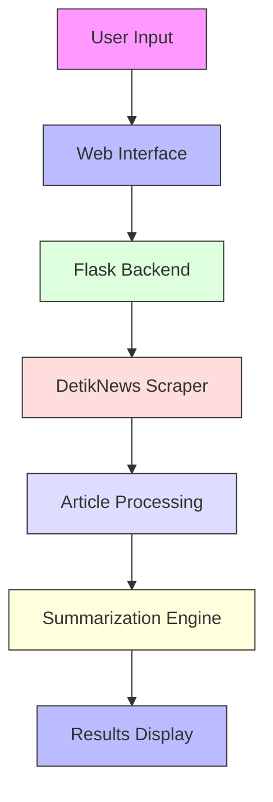
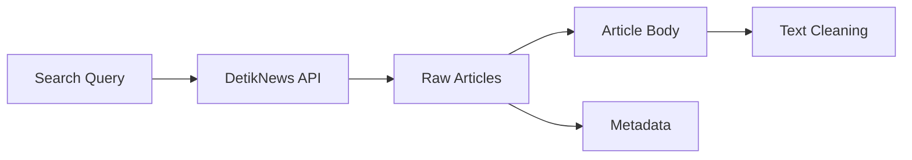
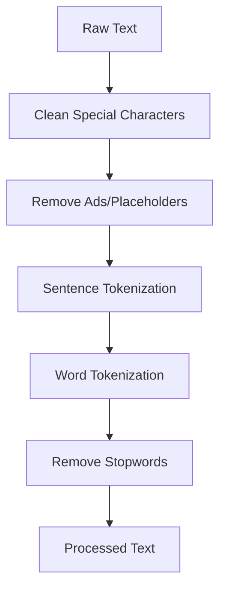
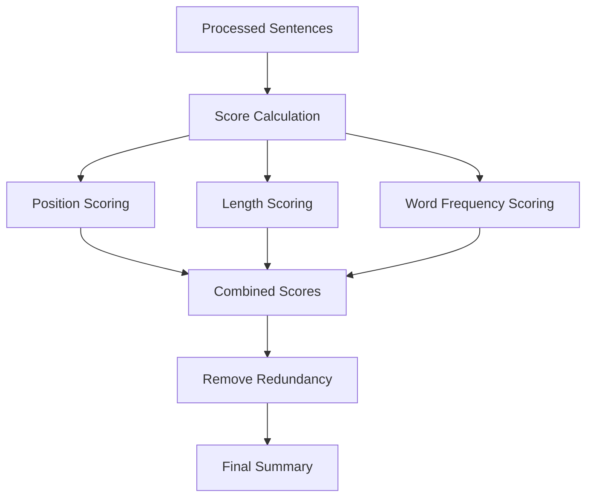
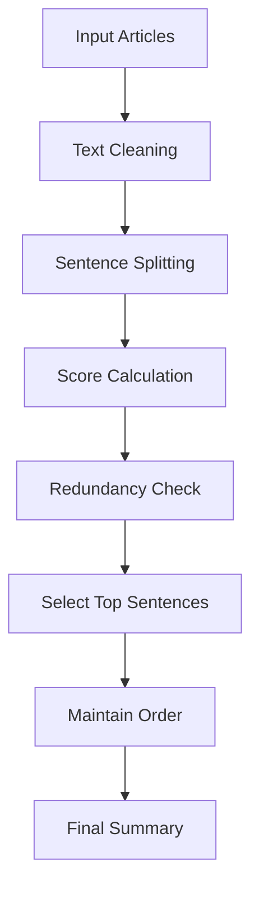

# News Summarizer Documentation

## Overview

This program is a news article summarizer that specializes in processing Indonesian news articles. It extracts key information from multiple articles on the same topic and generates a concise summary without relying on external LLM services.

## System Architecture



## Workflow Steps

### 1. Data Collection



### 2. Text Processing Pipeline



### 3. Summarization Process



## Detailed Component Explanation

### 1. Web Interface (`app.py`)

- Handles user queries through a Flask web application
- Manages the interaction between different components
- Renders results using Bootstrap-styled templates

### 2. Article Scraper (`detik_scraper.py`)

- Connects to DetikNews website
- Searches for articles based on user query
- Extracts article content and metadata
- Handles pagination and article detail views

### 3. Text Processor (`custom_summarizer.py`)

The summarizer uses several techniques to generate high-quality summaries:

#### a. Text Cleaning

- Removes special characters and extra whitespace
- Eliminates advertisements and placeholders
- Normalizes text formatting

#### b. Sentence Scoring

The system scores sentences based on multiple factors:

1. **Position Score**

   - First sentence: 3 points
   - Last sentence: 1 point
   - First third of text: 2 points
   - Others: 0 points

2. **Length Score**

   - Evaluates sentence length against average
   - Penalizes too short or too long sentences
   - Optimal range: 60% to 140% of average length

3. **Word Importance Score**
   - Calculates word frequencies
   - Removes Indonesian stopwords
   - Filters news-specific words (e.g., "kata", "ujar")

#### c. Redundancy Removal

- Uses Jaccard similarity to compare sentences
- Removes sentences that are too similar
- Maintains diversity in the final summary

### 4. Summary Generation Process



## Key Features

1. **Language-Specific Processing**

   - Customized for Indonesian language
   - Handles Indonesian stopwords
   - Recognizes news-specific patterns

2. **Multi-Article Processing**

   - Combines information from multiple sources
   - Removes duplicate information
   - Maintains context across articles

3. **Extractive Summarization**

   - Selects important sentences from original text
   - Preserves original meaning and context
   - Maintains grammatical correctness

4. **Detailed Process Visualization**
   - Shows step-by-step processing
   - Displays scoring details
   - Highlights selected sentences

## Usage Example

1. **User Input**

   ```
   Query: "Jakarta"
   ```

2. **System Process**

   - Fetches 5 recent articles from DetikNews
   - Cleans and processes text
   - Scores sentences based on importance
   - Removes redundant information
   - Generates summary
   - Displays process details and results

3. **Output**
   - Shows original articles
   - Displays sentence analysis
   - Presents final summary
   - Lists source articles
