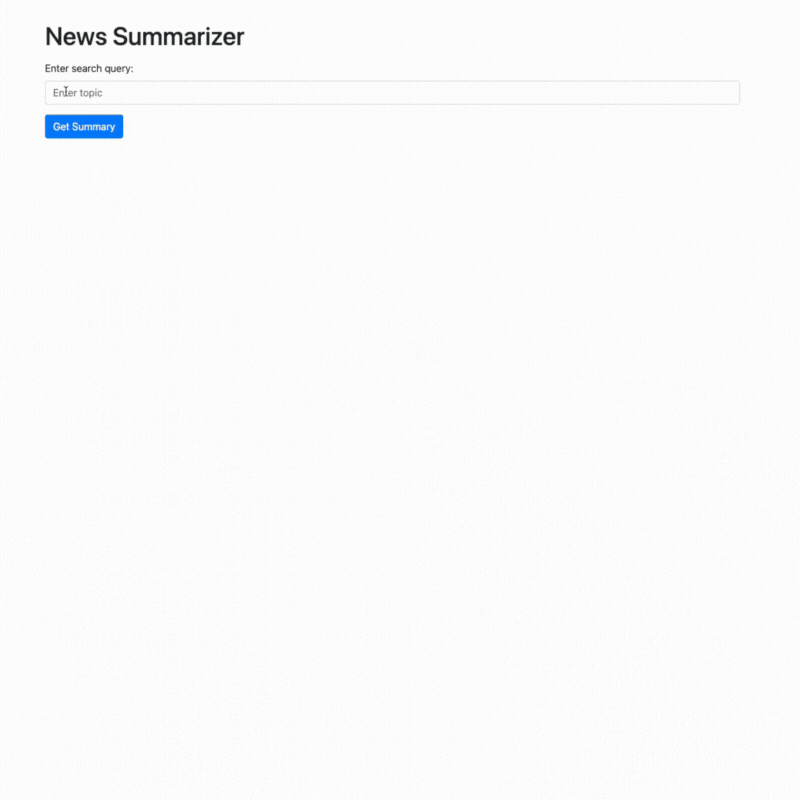

# News Summarizer Project Documentation

## Project Overview

This project provides a web application that allows users to input search queries for news articles, which are then summarized using a Groq API. The application retrieves news articles, processes them, and displays both the summarized content and the sources of the information.

Here's a demonstration of how the application works:


<div>
  
</div>

## Directory Structure

```plaintext
├── app.py
├── requirements.txt
├── src
│  ├── __init__.py
│  ├── detik_scraper.py
│  └── utils.py
├── static
│  ├── script.js
│  └── styles.css
└── templates
   └── index.html
```

## Files and Directories

### `app.py`

The main Flask application file that serves as the entry point for the web server. It handles routing, processes user input, retrieves and summarizes news articles, and renders the results in the HTML template.

### `requirements.txt`

A text file listing all Python dependencies required for the project. Use this file to set up your development environment with the necessary packages.

### `src/`

The source code directory containing the core functionality of the application.

#### `__init__.py`

An empty file used to mark the `src` directory as a Python package.

#### `detik_scraper.py`

Contains the `DetikNewsApi` class, which handles interactions with the Detik news website, including searching for news articles, retrieving article details, and processing the content.

#### `utils.py`

Contains utility functions:
- `extract_popular_words(articles: List[str]) -> List[str]`: Extracts popular words from a list of article texts.
- `clean_article_text(text: str) -> str`: Cleans the article text by removing unwanted elements such as advertisements.
- `summarize_with_groq(api_key: str, text: str, keywords: List[str]) -> str`: Summarizes the provided text using the Groq API.

### `static/`

The directory containing static files such as CSS and JavaScript.

#### `script.js`

JavaScript file for handling form submission and showing the loading spinner.

#### `styles.css`

CSS file for styling the web application, including the loading spinner.

### `templates/`

The directory containing HTML templates used for rendering the web pages.

#### `index.html`

The HTML template file for the main page of the Flask application. It provides a user interface for inputting search queries, displays the summarized text, and lists the sources of the news articles.

## Setup and Installation

1. **Clone the repository**:

   ```bash
   git clone <repository-url>
   cd <repository-directory>
   ```

2. **Set up a virtual environment**:

   ```bash
   python -m venv venv
   source venv/bin/activate  # On Windows, use `venv\Scripts\activate`
   ```

3. **Install dependencies**:

   ```bash
   pip install -r requirements.txt
   ```

4. **Create a `.env` file** in the root directory and add your Groq API key:

   ```plaintext
   GROQ_API=<your-groq-api-key>
   ```

5. **Run the Flask application**:

   ```bash
   python app.py
   ```

6. **Access the application** by navigating to `http://127.0.0.1:5000/` in your web browser.

## Usage

1. **Enter a search query** in the input field on the web page.
2. **Click the "Get Summary" button** to retrieve and summarize news articles related to the query.
3. **View the summary** and click the links to the original articles listed under the "Sources" section.

## Dependencies

- `Flask`: A micro web framework for Python.
- `requests`: A library for making HTTP requests.
- `python-dotenv`: A library for loading environment variables from a `.env` file.
- `BeautifulSoup`: A library for parsing HTML and XML documents.